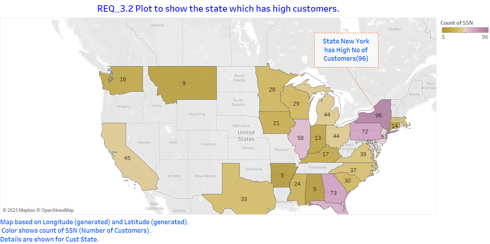

# Perscholas_Capstone_Sridevi
 
 # CAP 350 - Data Engineering - Capstone 
## Presented by Sridevi Melnatami Prasanna
The Capstone project provided me an opportunity to demonstrate the knowledge that I have acquired throughout the Data Engineering course provided by Perscholas powered by TEKSystems.


This Project requires us to work with the following technologies to manage an ETL process for a Loan Application dataset and a Credit Card dataset: Python (Pandas, advanced modules, e.g., Matplotlib), SQL, Apache Spark (Spark Core, Spark SQL), Python Visualization and Analytics libraries and Tableau.


__Additional Libraries Used__  
1. Pandas
2. Numpy
3. Colorama
4. image
5. Regex_Replace
6. Datetime
7. time

## Requirements Workflow Diagram
The workflow below helps to understand the application's requirements and flow.


# Credit Card Dataset Overview
The Credit Card System database is an independent system developed for managing activities such as registering new customers and approving or canceling requests, etc., using the architecture.
A credit card is issued to users to enact the payment system. It allows the cardholder to access financial services in exchange for the holder's promise to pay for them later. Below are three files that contain the customer’s transaction information and inventories in the credit card information.
a	CDW_SAPP_CUSTOMER.JSON: This file has the existing customer details.
b	CDW_SAPP_CREDITCARD.JSON: This file contains all credit card transaction information.
c	CDW_SAPP_BRANCH.JSON: Each branch’s information and details are recorded in this file. 

## Overview of LOAN Application Data API

Banks deal in all home loans. They have a presence across all urban, semi-urban, and rural areas. Customers first apply for a home loan; after that, a company will validate the customer's eligibility for a loan.
Banks want to automate the loan eligibility process (in real time) based on customer details provided while filling out the online application form. These details are Gender, Marital Status, Education, Number of Dependents, Income, Loan Amount, Credit History, and others. To automate this process, they have the task of identifying the customer segments to those who are eligible for loan amounts so that they can specifically target these customers. Here they have provided a partial dataset.

### API Endpoint: 
https://raw.githubusercontent.com/platformps/LoanDataset/main/loan_data.json
The above URL allows us to access information for loan application information. This dataset has all of the required fields for a loan application. We can access data from a REST API by sending an HTTP request and processing the response.

## Business Requirements - ETL
## Functional Requirements - Load Credit Card Database (SQL)
### Functional Requirement 1.1 - Data Extraction and Transformation with Python and PySpark
1. To create a Python and PySpark SQL program to read/extract the following JSON files.
 
    1. CDW_SAPP_BRANCH.JSON
    2. CDW_SAPP_CREDITCARD.JSON
    3. CDW_SAPP_CUSTOMER.JSON

2. To transform the data based on the specifications given in the mapping document. (Cleaning of the data)

Customer Information Table:


1. Convert the FIRST_NAME, LAST_NAME to the Title case
2. Convert the MIDDLE_NAME to lower case
3. Make a new field name FULL_STREET_ADDRESS by concatenating the STREET_NAME, APT_NO fields.
4. The format of the phone number needs to be changed to (XXX)XXX-XXXX

Branch Table:


1. If the BRANCH_ZIP is null, load the default value of 99999.
2. The format of the phone number needs to be changed to (XXX)XXX-XXXX

Credit Card Information Table:


1. Convert the fields DAY, MONTH and YEAR into a single field TIMEID with the format of YYYYMMDD

 ```#Formatting the Day, Month, Year as TIMEIDYYYYMMDD
    #Method 1:
    #creditcarddf = creditcarddf.withColumn("TIMEID", concat_ws("", col('YEAR'), lpad(col("MONTH"), 2,'0'), lpad(col('DAY'),2,'0')))

    #Method 2:
    date_cols = ["YEAR", lpad("MONTH", 2,'0'), lpad("DAY", 2,'0')]
    creditcarddf = creditcarddf.withColumn("TIMEID", concat_ws("", *date_cols))
```
### Functional Requirement 1.2 - Data loading into Database

Once PySpark reads data from JSON files, and then utilizes Python, PySpark, and Python modules to load data into RDBMS(SQL), perform the following:
 
a	Create a Database in SQL(MySQL), named “creditcard_capstone.”  
b	Create a Python and Pyspark Program to load/write the “Credit Card System Data” into RDBMS(creditcard_capstone).    
Tables should be created by the following names in RDBMS:    
CDW_SAPP_BRANCH    
CDW_SAPP_CREDIT_CARD    
CDW_SAPP_CUSTOMER    

__Logging__  
Every step of Extraction, Transformation and Loading into the database with the timestamp is logged into the logfile using the "log" feature. 

``` def log(message):
    timestamp_format = '%Y-%h-%d-%H:%M:%S' # Year-Monthname-Day-Hour-Minute-Second
    now = datetime.now() # get current timestamp
    timestamp = now.strftime(timestamp_format)
    with open("logfile.txt","a") as f:
        f.write(timestamp + ',' + message + '\n')
```
The diagram of the creditcard_capstone database is as below.


### Functional Requirements - Application Front-End
The front end console application which is a Python script interacts with the customer and collect the inputs from the customer based on the below functional requirements and do various actions on the dataframe and display the results to the cutomer.

### Functional Requirement 2.1 - Transaction Details Module

1. To display the transactions made by customers living in a given zip code for a given month and year. Order by day in descending order.  
    Based on the Zipcode, Month and Year provided by the customer, the console application gives all the transactions happened in that zipcode sorted in the descending order.
2. To display the number and total values of transactions for a given type.  
    There are 7 types of Transactions (Bills, Healthcare, Gas, Education, Test, Entertainment and Grocery), get the Transaction type from the customer and display the Number of Transactions and Values of Transactions for the selected type.
3. To display the total number and total values of transactions for branches in a given state.  
    Receive the State code from the customer to check the Number of Transactions and Total values of Transactions happened in that state across all the branches.

### Functional Requirement 2.2 - Customer Details Module

1. To check the existing account details of a customer  
    The program collects the last 4 digits of SSN, Last name to display the account details of a customer.

2. To modify the existing account details of a customer.  
    The program collects the full SSN from the customer and helps to modify the Last name, Credit card Number, Address(Street Number, City, State, Zipcode), Email and the Phone number.

3.  To generate a monthly bill for a credit card number for a given month and year  
    The program collects the last 4 digits of SSN, Last name and last 4 digits of Credit card Number , Month and Year to display the credit card summary containing Previous Month Balance, Current Month Balance and some other information.

4.  To display the transactions made by a customer between two dates. Order by year, month, and day in descending order   
    The program collects the Start date and End date from the customer and display the transactions happened between the 2 dates sorted in descending order.

## Functional Requirements 3 - Data Analysis and Visualization

__Challenges Faced while building the Visualization:__      
I first tried all the querying parts in Tableau like joining the tables, sorting the output, limiting the output etc but the Tableau version doesn't have a SQL connector and the visualization was taking long time. I was researching and read some articles and it gave me an idea about the Visualization tools. We have to use the visualization tools only to visualize and make a story between various plots. So then I have done the querying in the MS_SQL and exported the output to Tableau and did the visualization according to the requirements.

All the visualizations are built with Tableau. 


The quering is done in MS_SQL.


### Functional Requirements 3.1

Plot to show which transaction type has the highest transaction count.


### Functional Requirements 3.2

Plot to show which state has a high number of customers.



### Functional Requirements 3.3

Plot to show the sum of all transactions for the top 10 customers, and which customer has the highest transaction amount.


## Functional Requirements 4 - LOAN Application Dataset

### Functional Requirements 4.1

To GET (consume) data from the API endpoint for the loan application dataset.

### Functional Requirements 4.2

To find the status code of the API endpoint. The status code is 200

### Functional Requirements 4.3

To read data from the API, utilize PySpark to load data into RDBMS (SQL). The table name should be CDW-SAPP_loan_application in the database.
Note: From the requirement, the mentioned Table name didn't work as it has a special character "-", updated the table name to CDW_SAPP_loan_application.

## Functional Requirements 5 - Data Analysis and Visualization for LOAN Application

### Functional Requirements 5.1

To plot the percentage of applications approved for self-employed applicants.


### Functional Requirements 5.2

To plot the percentage of rejection for married male applicants.


### Functional Requirements 5.3

To plot the top three months with the largest volume of transaction data.


### Functional Requirements 5.4

To plot which branch processed the highest total dollar value of healthcare transactions.


## Testing

I have created a test case document which contains the Module, Test Scenarios, Test Description, Complexity, Date of Executing and Status. There are some testing which will be enhanced in the Version2.


## Author:
Sridevi Melnatami Prasanna (https://github.com/mpsridevi/)
